<div align="center">

# 🏠 HomeBase

### Euer privater Familien-Hub — in Echtzeit synchron auf Web & Android.

Aufgaben, Einkauf, Notizen, Zeiterfassung und Rezepte an **einem** Ort.
Selbst gehostet auf dem eigenen NAS, erreichbar von überall per HTTPS — **ohne Cloud-Zwang, ohne Abo, ohne Werbung.**

<br/>


<br/>

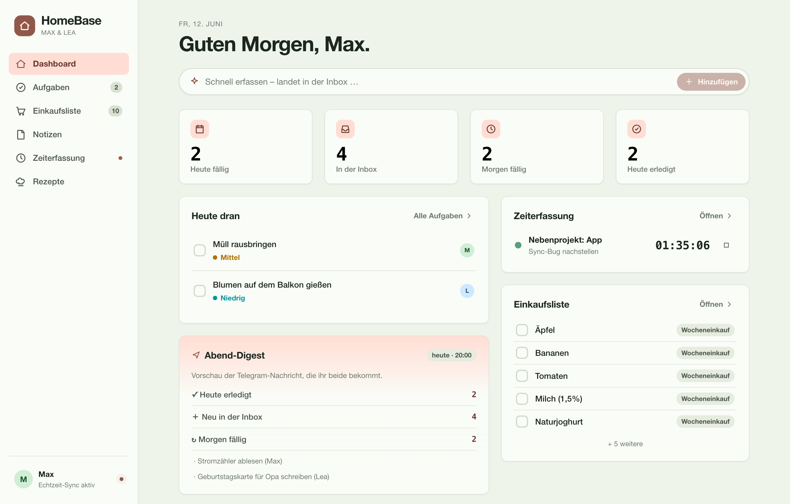

</div>

---

## Inhalt

- [Warum HomeBase?](#warum-homebase)
- [Funktionen](#funktionen)
- [HomeBase in der Hosentasche](#homebase-in-der-hosentasche)
- [Hell & Dunkel](#hell--dunkel)
- [Architektur](#architektur)
- [Schnellstart (lokal)](#schnellstart-lokal)
- [Deployment auf Synology NAS](#deployment-auf-synology-nas)
- [Umgebungsvariablen](#umgebungsvariablen)
- [Projektstruktur](#projektstruktur)

---

## Warum HomeBase?

Das Familienleben verteilt sich heute über ein Dutzend Apps: die Einkaufsliste im
WhatsApp-Chat, To-dos auf Haftnotizen am Kühlschrank, Termine im Kopf, Rezepte
irgendwo zwischen Lesezeichen und Screenshots. Jede App will ein Abo, lebt in einer
fremden Cloud und ist auf große Teams oder Werbung ausgelegt — nicht auf zwei
Menschen, die einfach ihren gemeinsamen Alltag organisieren wollen.

**HomeBase bündelt all das an einem Ort — und der gehört euch.** Eine kleine, selbst
gehostete App auf dem eigenen NAS, erreichbar von überall per HTTPS (ohne VPN), die
Web und Android in Echtzeit synchron hält. Was die eine einträgt, sieht der andere im
selben Moment.

|  |  |
|---|---|
| 🔒 **Privat & selbst gehostet** | Läuft auf eurem Synology-NAS — eure Daten verlassen nie euer Zuhause. Kein Abo, kein Tracking, keine Werbung. |
| ⚡ **Echtzeit auf beiden Geräten** | REST für die Daten, WebSocket für Live-Updates. Abhaken, eintragen, Timer starten — sofort beim Partner sichtbar. |
| 👫 **Gebaut für genau zwei** | Kein Team-Overhead, kein Registrierungs-Flow. Zwei feste Konten, ein gemeinsamer Haushalt. |
| 🧩 **Ein Hub statt fünf Apps** | Aufgaben, Einkauf, Notizen, Zeiterfassung, Rezepte und Abwesenheitskalender teilen sich Design, Login und Sync. |
| 🌐 **Überall erreichbar** | DynDNS + Let's-Encrypt-HTTPS über den Synology-Reverse-Proxy — kein VPN nötig. |
| 🔔 **Nichts geht unter** | Abendlicher Telegram-Digest: heute erledigt, neu in der Inbox, morgen fällig. |

---

## Funktionen

### ✅ Aufgaben — erst erfassen, dann ordnen

Nach dem **Inbox-Prinzip**: nur einen Titel eintippen, fertig — der Rest (Termin,
Person, Priorität, Liste) wird später ergänzt. Aufgaben fließen durch einen klaren
Status-Flow `INBOX → PLANNED → DONE`, gruppiert nach *Heute / Demnächst / Ohne Datum*,
mit Unteraufgaben, Prioritäten und geteilten oder privaten Listen. Wiederkehrende
Aufgaben (täglich/wöchentlich/monatlich) erzeugen ihre nächste Instanz automatisch.

<p align="center">
  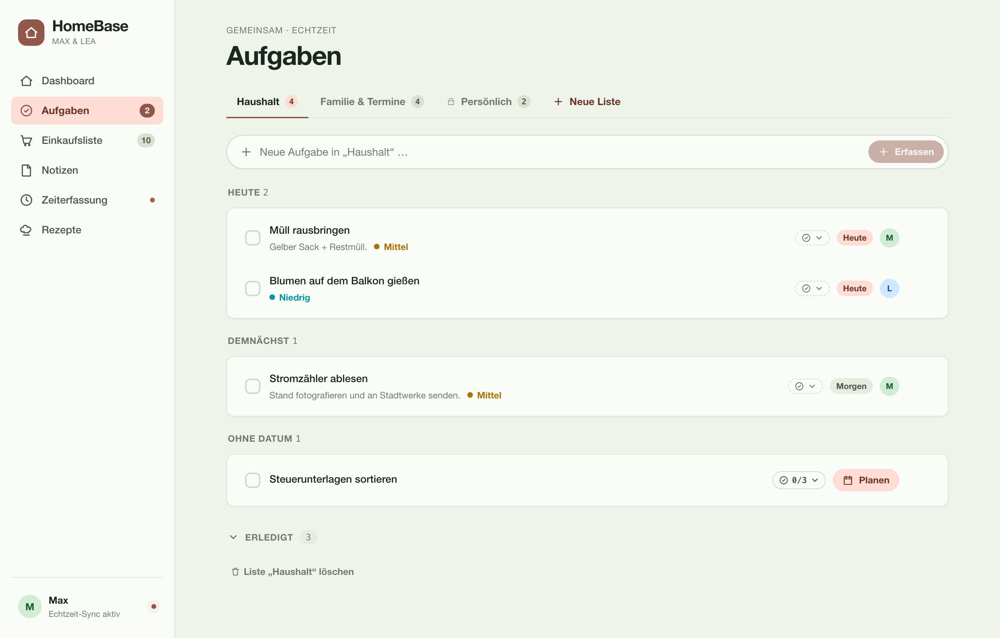
</p>

### 🛒 Einkaufsliste — gemeinsam, in Echtzeit

Mehrere geteilte Listen (Wocheneinkauf, Drogerie …), Artikel hinzufügen und abhaken —
live auf beiden Geräten. Abgehakte Artikel wandern in den **„Im Wagen“**-Bereich und
lassen sich mit einem Tipp aufräumen. Jeder Eintrag zeigt, wer ihn hinzugefügt hat.

<p align="center">
  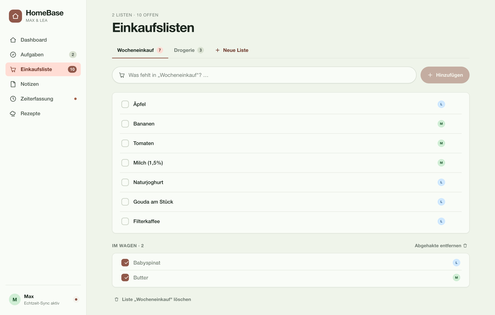
</p>

### 📝 Notizen — Markdown, Tags & Bilder

Vollwertige Markdown-Notizen mit Volltextsuche, Tag-Filtern und Bild-Anhängen.
Sichtbarkeit pro Notiz: **privat** oder **geteilt** — Geteiltes können beide sehen und
bearbeiten, Privates bleibt privat.

<p align="center">
  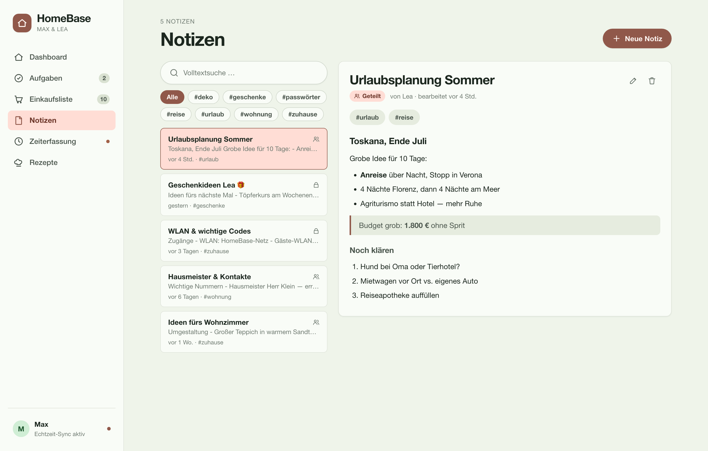
</p>

### ⏱️ Zeiterfassung — Timer, Projekte & Wochensoll

Projektbezogene Zeiterfassung mit Start/Stopp-Timer (pro Person läuft höchstens einer).
Einträge nach Tag gruppiert, Projekt-Detailansichten mit Kennzahlen und Wochenüberblick.
Dazu **Wochensoll & Ende-Prognose**: HomeBase rechnet aus Soll-Stunden, Feiertagen und
Abwesenheiten aus, wie lange ihr heute noch arbeiten müsst — und exportiert alles als CSV.

<p align="center">
  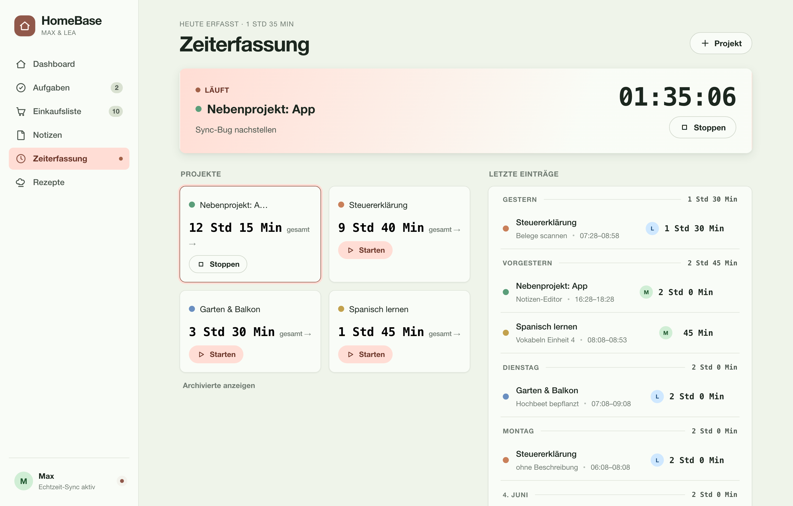
</p>

### 🍳 Rezepte — sammeln, skalieren, kochen

Rezeptsammlung mit Zutaten und Zubereitungsschritten, filterbar nach Kategorie. Die
**Portionierung rechnet die Mengen live um**, Zutaten lassen sich mit einem Tipp auf die
Einkaufsliste übernehmen, und einzelne Rezepte gibt es als Markdown- oder PDF-Export.

<p align="center">
  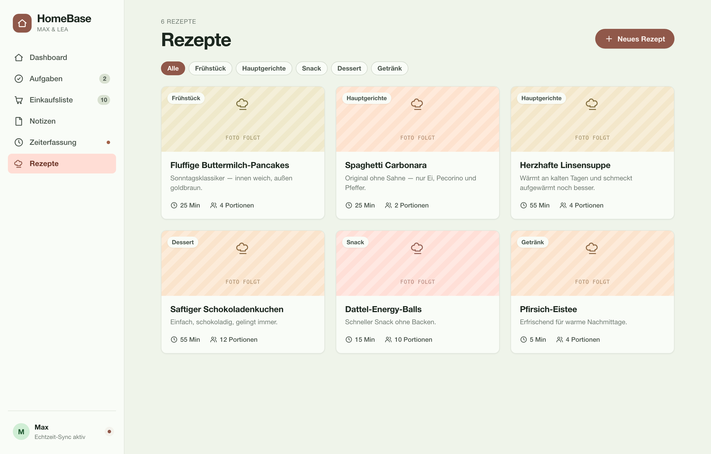
</p>

### 🗓️ Abwesenheitskalender — wer ist wann da?

Der geteilte Familienkalender ersetzt die Excel-Tabelle für Urlaub, Krankheit und
Kind-krank-Tage — als **Jahresraster** (die ganze Familie auf einen Blick) oder
**Monatskalender**. Mit deutschen Feiertagen je Bundesland, festen freien Teilzeit-Tagen,
halben Tagen, Kita-Schließtagen und einer Budget-Übersicht (Anspruch, Übertrag mit Verfall,
Krank-/Kind-krank-Zähler). Jede Tageszelle ist diagonal geteilt — links Max, rechts Lea.

<table>
  <tr>
    <td align="center" valign="top">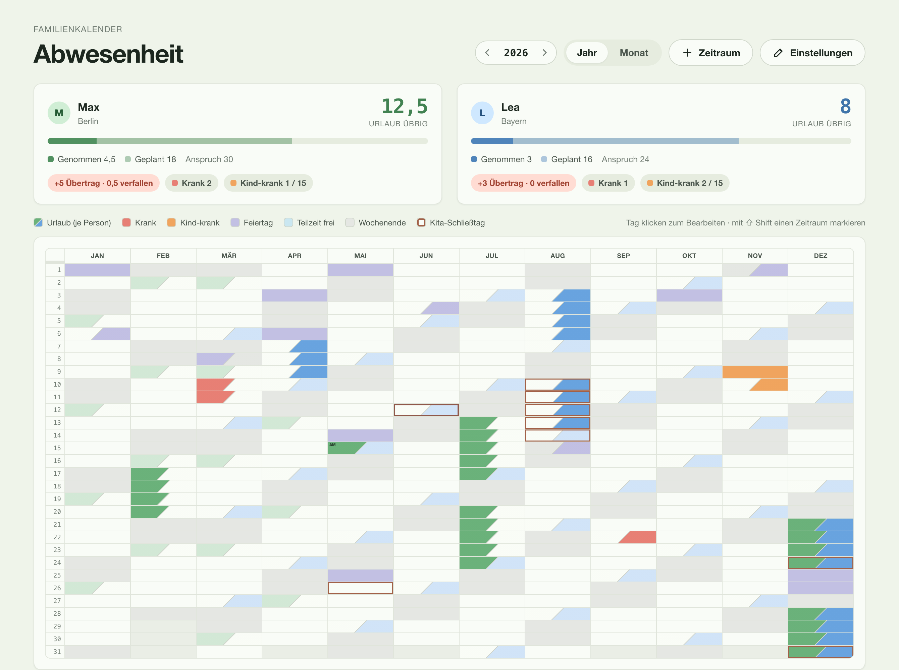<br/><sub><b>Jahresraster im Web</b></sub></td>
    <td align="center" valign="top">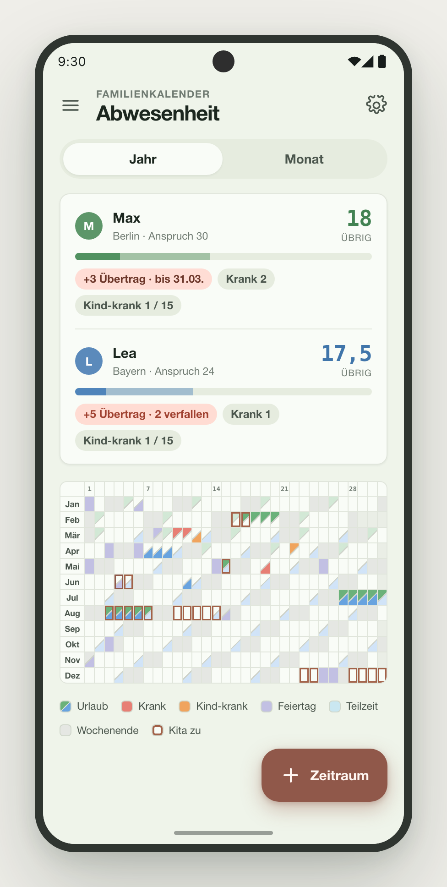<br/><sub><b>… und auf Android</b></sub></td>
  </tr>
</table>

### … und außerdem

- 🔁 **Wiederkehrende Aufgaben** — leichtgewichtige Wiederholung direkt am Todo, abschluss-getrieben plus Safety-Net-Scheduler.
- 🔔 **Telegram-Digest** — täglich zur in-app eingestellten Uhrzeit.
- ⚙️ **In-App-Einstellungen** — Haushaltsname, Digest-Zeit, Wochensoll, Kalender u. v. m. ohne Server-Neustart.
- 🛡️ **Sicherheit** — JWT-Login mit IP-basiertem Login-Throttling (exponentielles Backoff) gegen Brute-Force.

---

## HomeBase in der Hosentasche

Dieselbe App, dieselben Daten — nativ als **Jetpack-Compose-App** für Android. Jede
Änderung am Handy ist im selben Moment im Web sichtbar und umgekehrt.

<table align="center">
  <tr>
    <td align="center">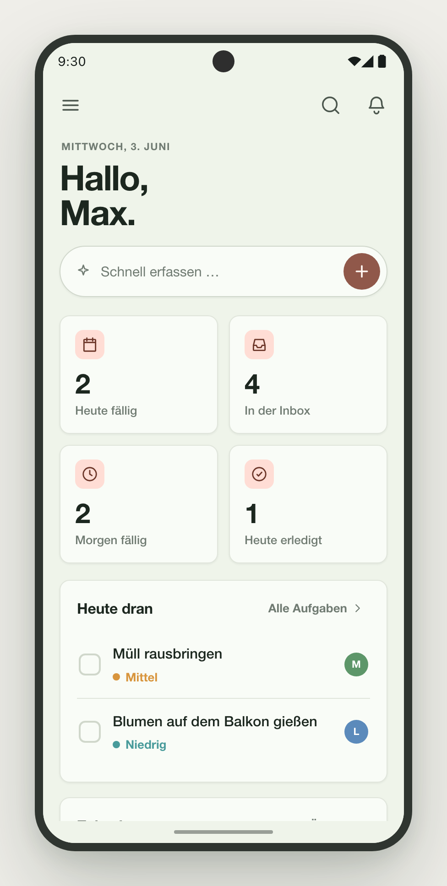<br/><sub><b>Dashboard</b></sub></td>
    <td align="center">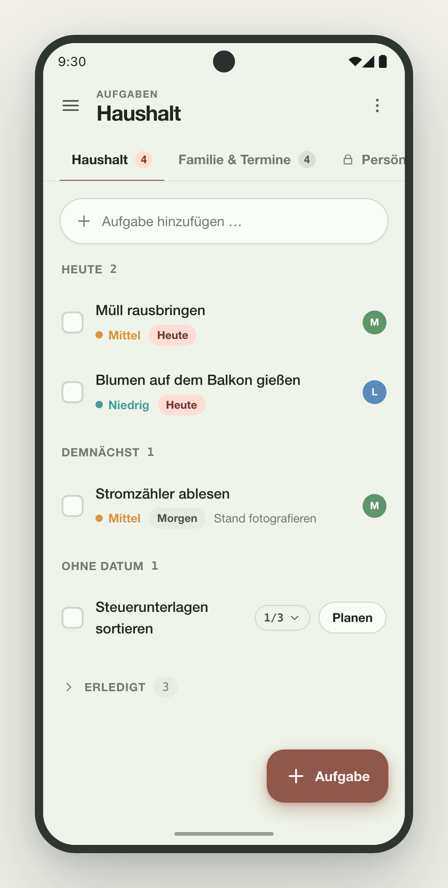<br/><sub><b>Aufgaben</b></sub></td>
    <td align="center">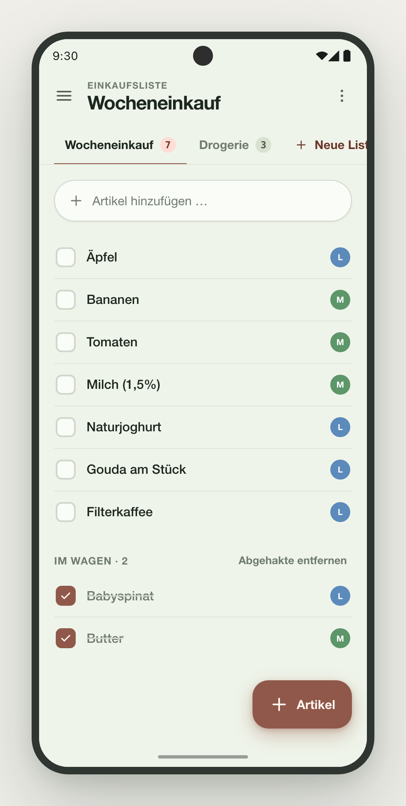<br/><sub><b>Einkaufsliste</b></sub></td>
  </tr>
  <tr>
    <td align="center">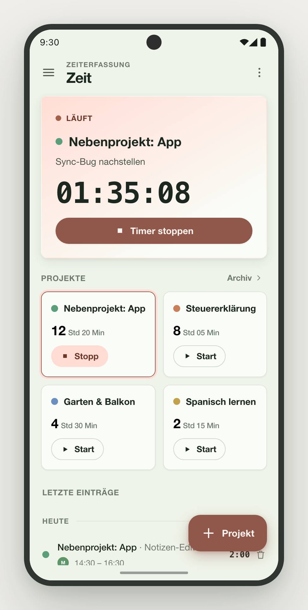<br/><sub><b>Zeiterfassung</b></sub></td>
    <td align="center">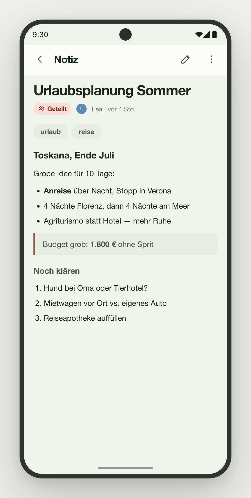<br/><sub><b>Notizen</b></sub></td>
    <td align="center">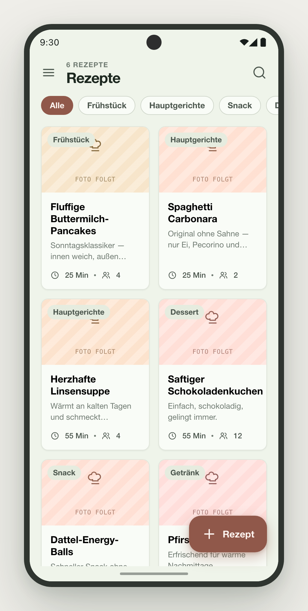<br/><sub><b>Rezepte</b></sub></td>
  </tr>
</table>

---

## Hell & Dunkel

Die gesamte Web-Oberfläche kennt ein helles **und** ein dunkles Thema (frei umschaltbar,
dazu Akzentfarbe und Dichte). Dieselbe Ansicht, zwei Stimmungen:

<table>
  <tr>
    <td align="center" width="50%"><br/><sub>☀️ Hell</sub></td>
    <td align="center" width="50%">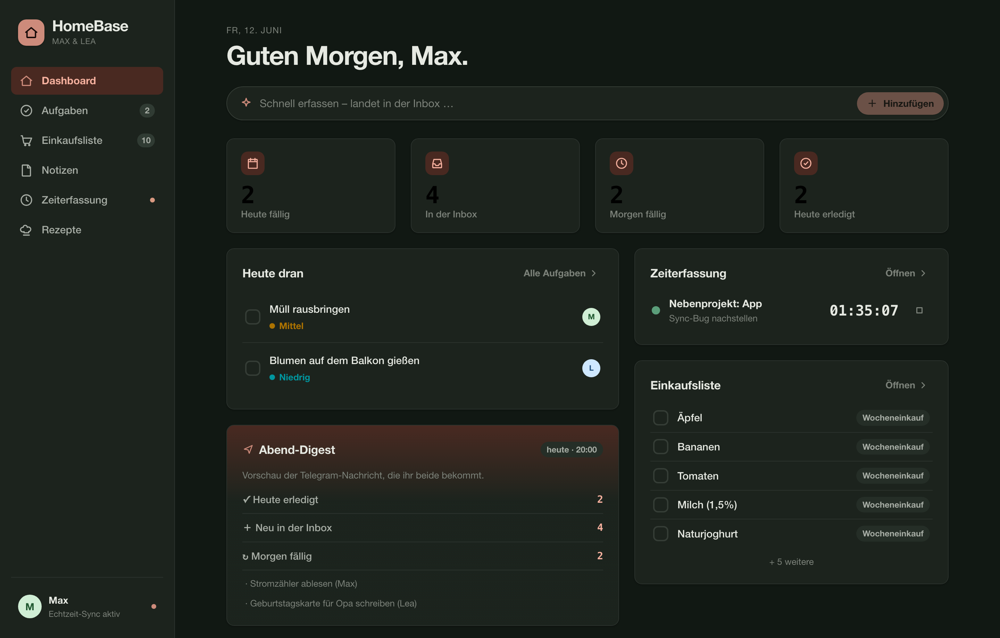<br/><sub>🌙 Dunkel</sub></td>
  </tr>
</table>

<p align="center">
  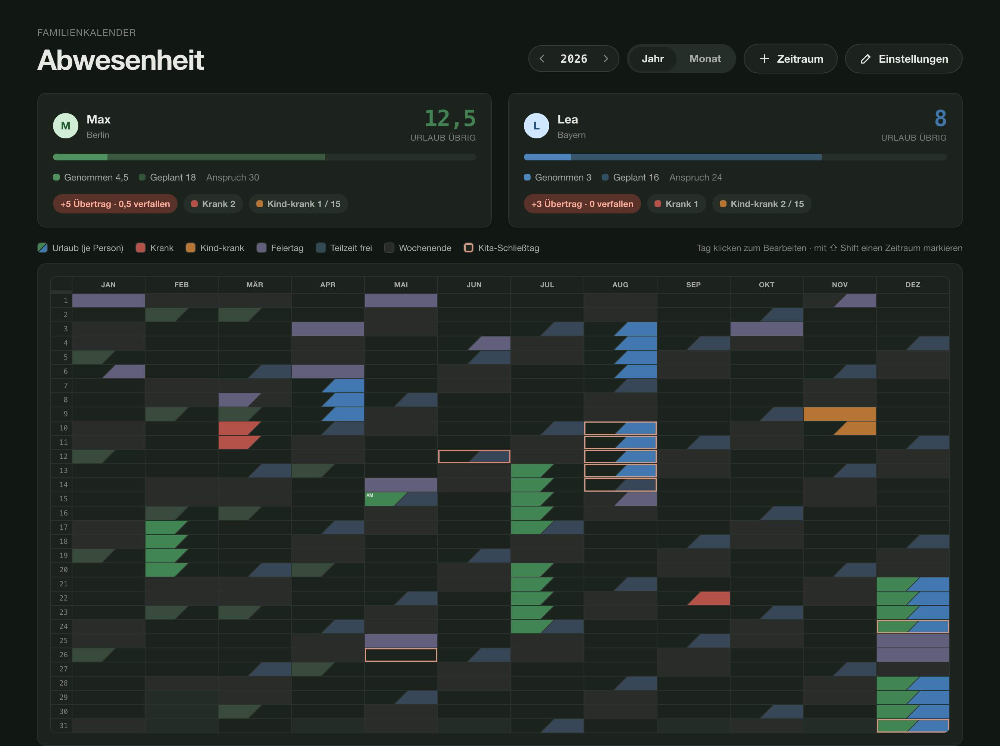<br/>
  <sub>Auch der Familienkalender trägt Dunkel.</sub>
</p>

---

## Architektur

Zwei Clients, ein Backend, eine Datenbank — alles hinter einer einzigen TLS-Schicht.
Daten gehen per REST, Live-Updates per WebSocket.

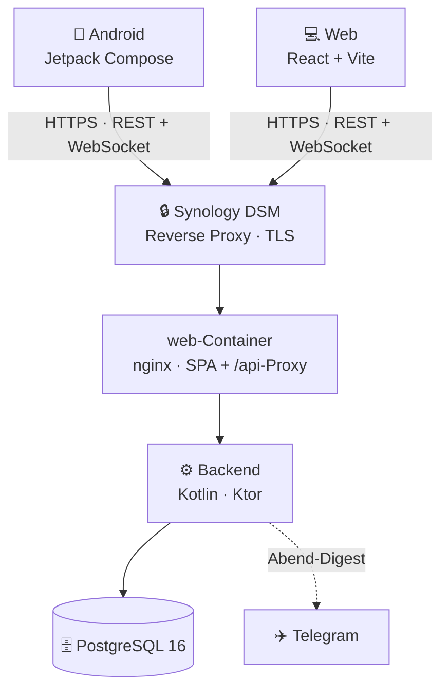

| Schicht   | Technologie                                              |
|-----------|---------------------------------------------------------|
| Backend   | Kotlin · Ktor · Exposed ORM · Flyway · PostgreSQL 16     |
| Web       | React 18 · Vite · TypeScript · Tailwind CSS              |
| Android   | Jetpack Compose · Kotlin Coroutines + Flow · Retrofit    |
| Echtzeit  | WebSockets (REST für CRUD, WS für Sync)                  |
| Proxy     | Synology DSM Reverse Proxy (TLS) → `web`-Container (nginx) |
| Hosting   | Synology NAS · Docker · Images via GHCR · GitHub Actions |

---

## Schnellstart (lokal)

**Voraussetzungen:** Docker & Docker Compose · JDK 21 (`sdk install java 21-tem`) · Node 20 (`nvm install 20`)

```bash
# 1. Umgebungsvariablen anlegen und anpassen (DB_PASSWORD, JWT_SECRET)
cp .env.example .env

# 2. Datenbank starten
docker compose -f docker-compose.dev.yml up -d

# 3. Backend starten  →  http://localhost:8080/api/v1/health
cd backend && ./gradlew run

# 4. Web starten  →  http://localhost:5173
cd web && npm install && npm run dev
```

JWT-Secret erzeugen: `openssl rand -hex 32`

---

## Deployment auf Synology NAS

> 📘 **Ausführliche Schritt-für-Schritt-Anleitung** (NAS, FRITZ!Box-Routing/DynDNS,
> HTTPS-Zertifikat, Android-App): siehe [`docs/DEPLOYMENT.md`](docs/DEPLOYMENT.md).

**Voraussetzungen:** DSM 7.x mit Container Manager · DynDNS-Domain · Let's-Encrypt-Zertifikat
(DSM → Systemsteuerung → Sicherheit → Zertifikat).

### HTTPS via DSM Reverse Proxy

TLS terminiert Synology DSM — kein Zertifikat-Mount, kein Container-Neustart bei der Erneuerung:

1. **Sicherheit → Zertifikat:** Let's-Encrypt-Zertifikat für die Domain anlegen (Port 80 muss von außen erreichbar sein).
2. **Anmeldeportal → Erweitert → Reverse Proxy → Erstellen:**
   - Quelle: **HTTPS**, deine Domain, Port **443**
   - Ziel: **HTTP**, **localhost**, Port **3000** (der `web`-Container)
   - **WebSocket** aktivieren (Custom Header) — nötig für den Echtzeit-Sync
3. Dem Dienst unter **Zertifikat → Konfigurieren** das Zertifikat aus Schritt 1 zuweisen.

### Deploy

Backend- und Web-Images baut die CI und pusht sie nach GHCR — die NAS **zieht** sie nur
(kein Build aus dem Quellcode). Auf der NAS genügen `docker-compose.yml` und `.env`:

```bash
# Einmalig: an GHCR anmelden (privates Repo ⇒ private Images)
echo <GITHUB_PAT> | docker login ghcr.io -u <github-user> --password-stdin

# .env mit Produktionswerten befüllen, dann Images ziehen und starten
cp .env.example .env && nano .env
docker compose pull && docker compose up -d

# Health-Check
curl https://home.example.com/api/v1/health   # → {"status":"ok"}
```

Aktualisieren später: `docker compose pull && docker compose up -d`.

---

## Umgebungsvariablen

| Variable             | Beschreibung                                           | Beispiel                              |
|----------------------|--------------------------------------------------------|---------------------------------------|
| `DB_URL`             | JDBC-URL der Datenbank                                 | `jdbc:postgresql://db:5432/homebase`  |
| `DB_USER`            | Datenbanknutzer                                        | `homebase`                            |
| `DB_PASSWORD`        | Datenbankpasswort                                      | *(sicheres Passwort)*                 |
| `JWT_SECRET`         | HMAC-Secret für JWT-Signing                            | *(32+ zufällige Bytes, hex)*          |
| `TELEGRAM_BOT_TOKEN` | Telegram Bot Token (optional — fehlt er, ruht der Digest) | `123456:ABC-...`                   |
| `TELEGRAM_CHAT_ID`   | Empfänger-Chat-ID (optional)                           | `-1001234567890`                      |
| `UPLOAD_DIR`         | Speicherort der Notizbilder (prod: per Volume gesetzt) | `/data/uploads`                       |
| `MAX_UPLOAD_MB`      | Max. Größe pro Notizbild in MB (optional)              | `10`                                  |
| `TRUSTED_PROXY_COUNT`| Vertrauenswürdige Reverse-Proxy-Hops (Login-Throttling) | `2`                                  |

> **In-app statt env:** Was zur Laufzeit editierbar ist, lebt in der Datenbank, nicht in
> der `.env`. **Haushaltsname** (Default `Mäxchen`) und **Digest-Uhrzeit** (Default `20:00`)
> setzt ihr unter *Einstellungen → Haushalt / Benachrichtigungen*. Nur Secrets (JWT/DB/
> Telegram) und reine Infrastruktur (TZ, Ports, Upload-Pfad, Proxy-Count) bleiben env.

---

## Projektstruktur

```
homebase/
├── backend/             — Kotlin + Ktor API + WebSocket Server (Exposed, Flyway)
├── web/                 — React + Vite + TS Frontend (nginx: SPA + /api-Proxy)
├── android/             — Jetpack Compose App
├── docker-compose.yml   — Produktion (Synology NAS, Images aus GHCR)
├── docker-compose.dev.yml — Lokale Entwicklung (nur DB)
├── docs/                — Deployment-Doku, Design-Mockups & Screenshots
└── scripts/             — setup-env / deploy / backup / restore
```

Geplante Features und Funde leben als **GitHub Issues** (Hintergrund: [`backlog/README.md`](backlog/README.md)).

---

<div align="center">
<sub>Privates Familienprojekt — gebaut für ein Zuhause mit zwei Menschen. 🏡</sub>
</div>
